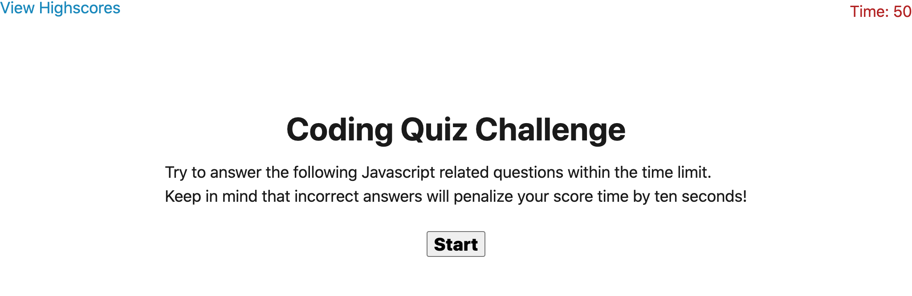

# CodeQuiz
Link: https://edgaro93.github.io/CodeQuiz/

## Description

This CodeQuiz was created using Javascript and JQuery. I wanted to create a quiz that had a timer and would subtract the time when answered wrong. I also wanted the quiz to move when a question was anwswered. I wanted the quiz to end when timer reached zero or all questions answered. When the game is over, I wanted to be able save my score with my initials and be able to acess it later. I found it was best to tackle this project by trying to work on it one piece at a time. I learned to not spend as much time on styling when the bulk of the coding needs to be done on Javascript. I was able to learn more about local storage and using objects as well as leverage using JQuery. In future updates, I would like to include more styling or effects, change the quiz lenght and timer as well as maybe working on creating bonuses for right questiosn. 

## Screenshot

## Acknowlegments
~~~
I would like to thank my tutor and TAs as well online resources such as W3 schools, MDN Web Docs, and Stack Overflow.
~~~